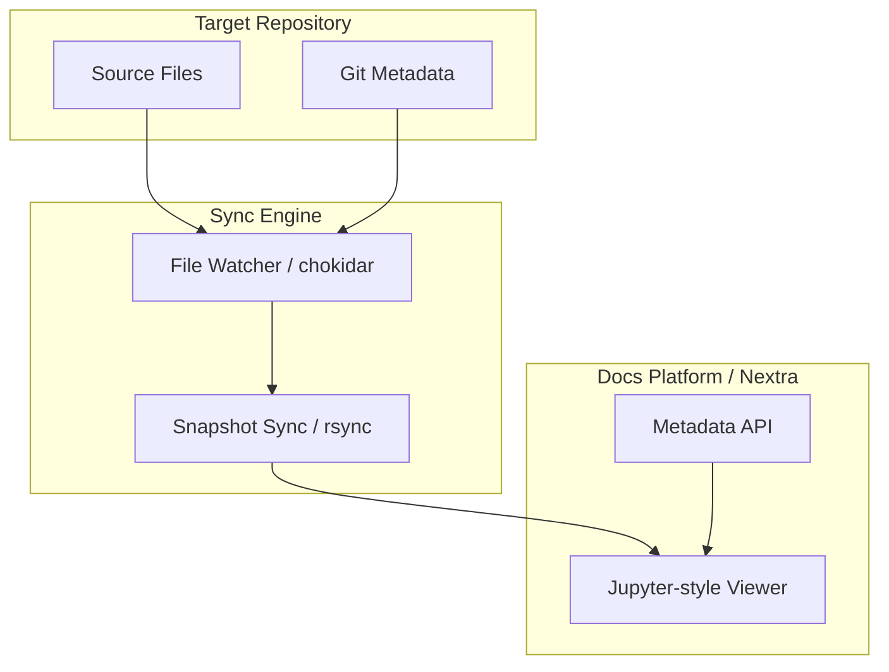

# Architecture

CodexLM is built on a modular architecture...

## System Flow

```mermaid
graph TD;
    subgraph Target_Repo [Target Repository]
        Files[Source Files]
        Git[Git Metadata]
    end

    subgraph Sync_Engine [Sync Engine]
        Watcher[File Watcher / chokidar]
        Rsync[Snapshot Sync / rsync]
    end

    subgraph Docs_Platform [Docs Platform / Nextra]
        Viewer[Jupyter-style Viewer]
        API[Metadata API]
    end

    Files --> Watcher
    Git --> Watcher
    Watcher --> Rsync
    Rsync --> Viewer
    API --> Viewer
```
